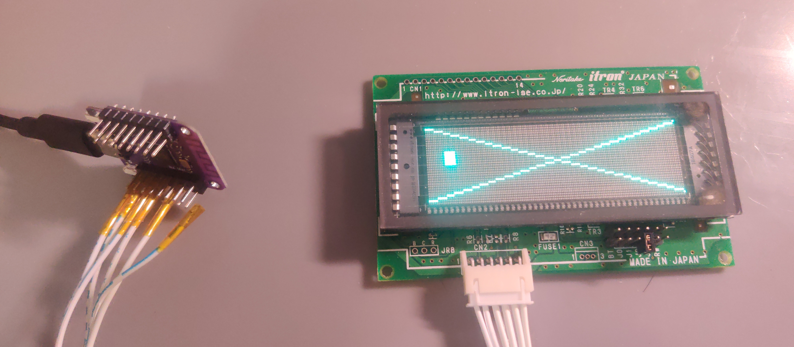

# circuitpython-vfd-gu7000

API for Noritake's itron GU7000 series VFD. This is a partial implementation.

See `example.py` for actual usage.

## Notes

- Not all GU7000s have native support for bit paint. As a workaround, I implemented `fill_rect` and `fill_line` as generic solutions.
- This lib only implements communication through async serial port(aka. UART) because it's relatively easy to implement. It should be easy to implement for other connection types.
- For this lib, the major difference between MicroPython and CircuitPython is the serial API. It should be easy to port this lib to MicroPython.
    - BTW it's also easy to port the lib to CPython.

## License

This project is licensed under the MIT license. See `LICENSE` for details.

